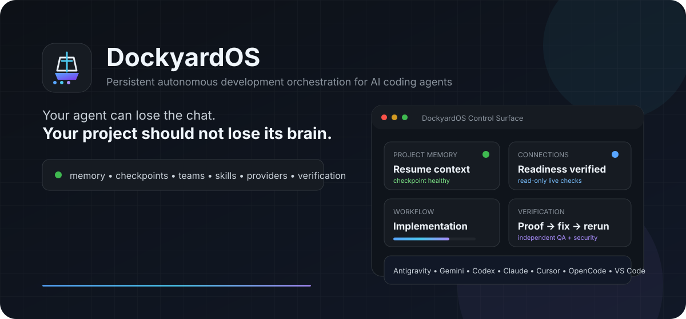
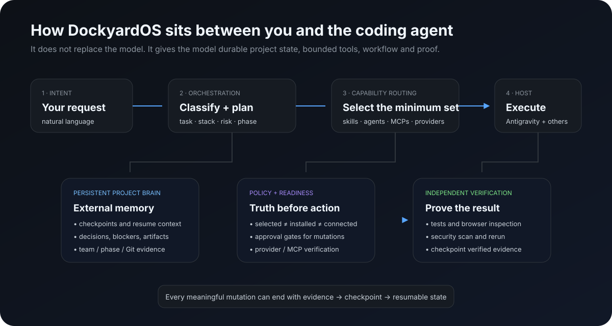
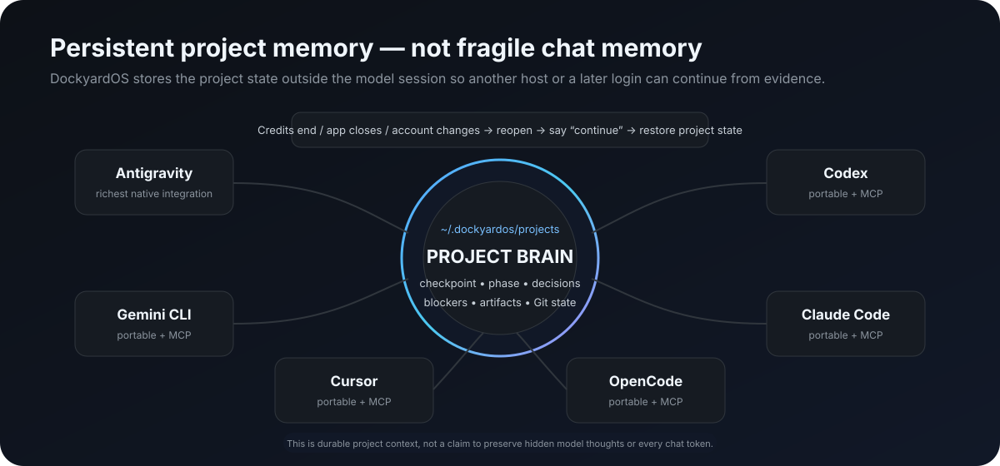
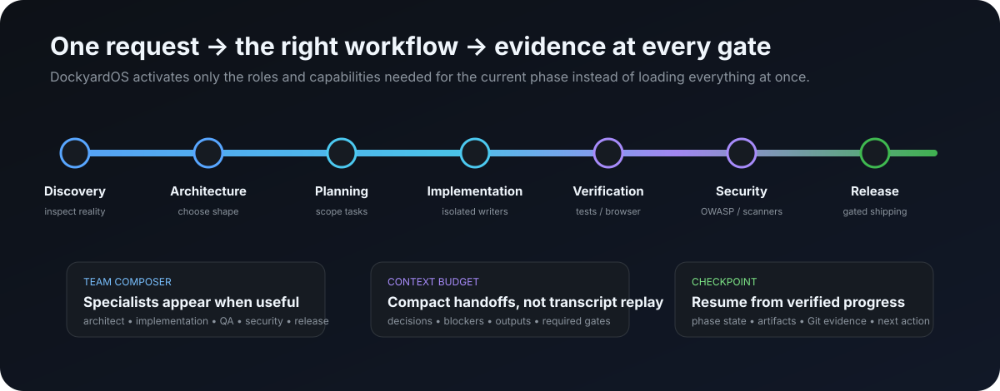
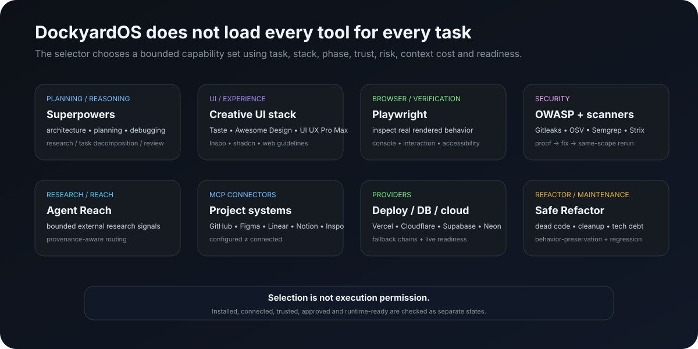
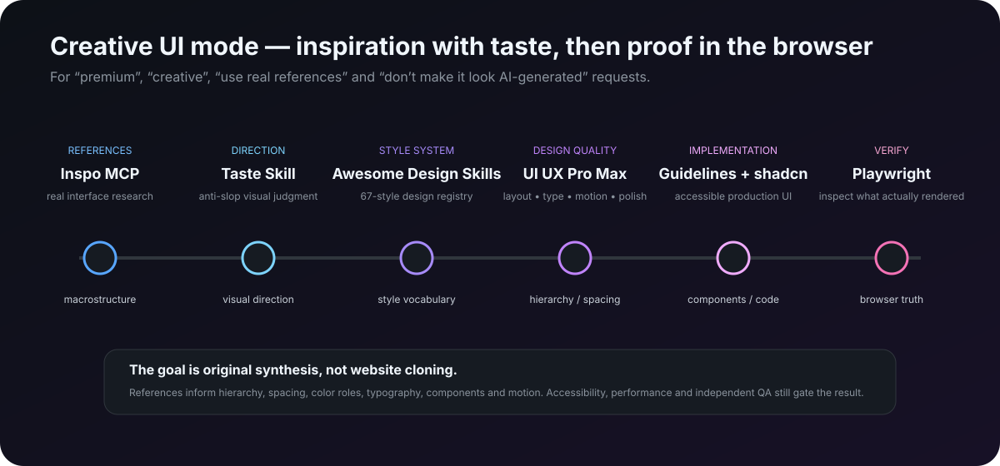
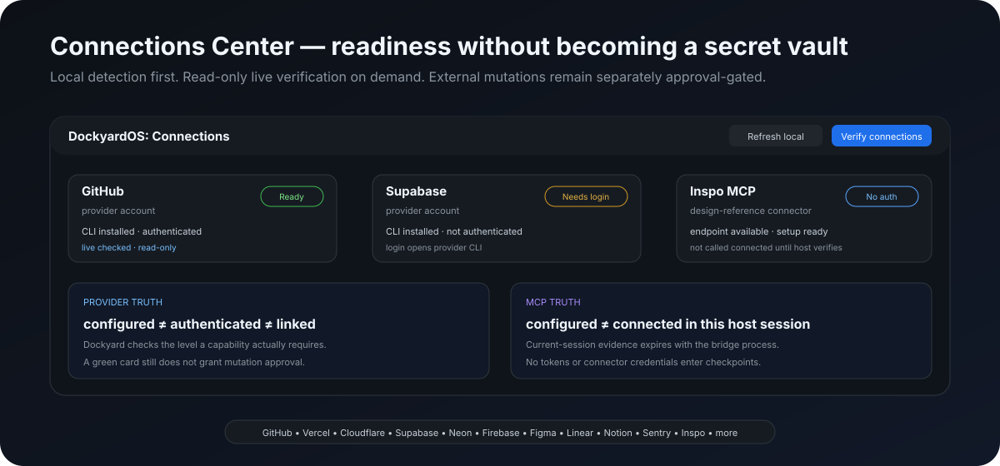
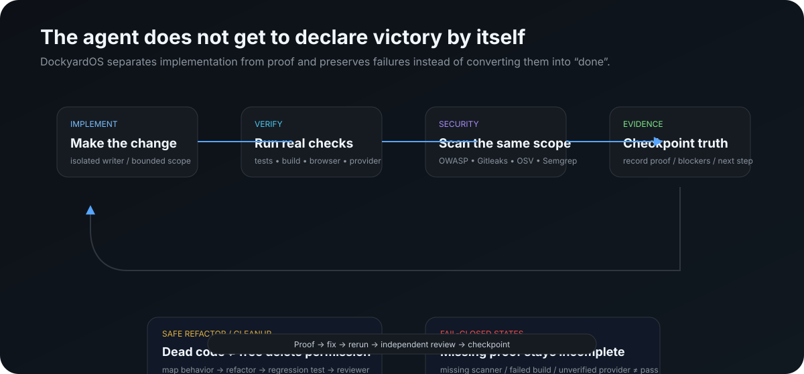
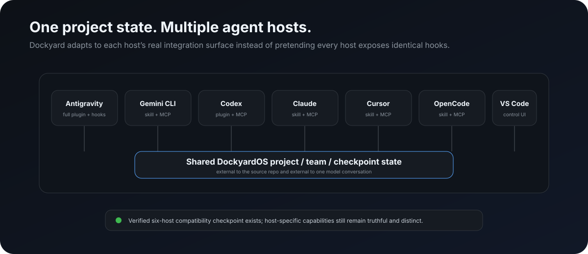

<p align="center">
  
</p>

<h1 align="center">DockyardOS</h1>
<p align="center"><strong>Build. Orchestrate. Verify. Continue.</strong></p>
<p align="center">A persistent AI engineering control layer for long-running software projects.</p>

<p align="center">
  <code>MIT</code>&nbsp;&nbsp;
  <code>VS Code 1.95+</code>&nbsp;&nbsp;
  <code>Universal VSIX</code>&nbsp;&nbsp;
  <code>Antigravity · Gemini · Codex · Claude · Cursor · OpenCode</code>
</p>

---

## Why DockyardOS exists

AI coding agents can write a lot of code, but long projects still have very human problems:

- a session ends and the next session does not know what was really finished;
- credits run out in the middle of a multi-step build;
- switching account, model or IDE loses useful project context;
- the agent loads too many tools and wastes context;
- a provider is installed but not actually authenticated or connected;
- the model says “done” before tests, browser checks or security checks prove it;
- a refactor removes code without proving behavior stayed the same;
- UI work becomes the same generic gradient hero, card grid and AI-looking layout;
- deployment, database and Git actions become dangerous if “connected” is treated as “approved”.

**DockyardOS is the project-level layer that solves those problems around the coding agent.**

It does not replace the model. It gives the model a durable project brain, a workflow, a controlled capability system, real connector state, specialist agents and verification gates.

> **Your agent can lose the chat. Your project should not lose its brain.**

---

## What DockyardOS is

DockyardOS is a **persistent autonomous-development orchestration layer**.

It sits between the user, the project and the coding-agent host:

<p align="center">
  
</p>

The model still comes from Antigravity, Gemini, Codex, Claude, Cursor or OpenCode. DockyardOS adds the parts that need to survive outside one model conversation:

| Layer | Purpose |
| --- | --- |
| **Project Brain** | Stable project identity, checkpoints, decisions, blockers, artifacts, team state and bounded Git evidence. |
| **Workflow Engine** | Discovery → architecture → planning → implementation → verification → security → release. |
| **Capability Router** | Chooses a bounded set of skills, agents, tools, MCPs and providers for the current task. |
| **Connections Layer** | Separates installed, configured, authenticated, linked and current-session connected states. |
| **Verification Layer** | Tests, browser inspection, security scans, provider-native verification and independent reviewers. |
| **Safety Layer** | Approval policy for production, destructive, secret-bearing and external mutations. |
| **Universal Control Center** | A VS Code UI for project state, agents, skills, connections, memory, workflows, security, community packages and settings. |

---

## The Universal Control Center

DockyardOS is designed to be usable without remembering a list of CLI commands.

The VSIX opens a consistent DockyardOS control center with a fixed dark graffiti-inspired visual system and one navigation model across the dashboard, Connections Center and Community Hub.

The main UI includes:

- **Dashboard** — project health, current phase, checkpoint, connections and quick actions;
- **Project** — initialization, status and project state;
- **Agents** — active specialist team and team actions;
- **Skills** — capability stack and Community Hub access;
- **Connections** — provider and MCP readiness;
- **Memory** — persistent project brain and continuation state;
- **Workflows** — project recipes such as Creative UI, Safe Refactor and Security Hardening;
- **Security** — policy and verification entry points;
- **Community** — signed/quarantined capability distribution;
- **Settings** — host, operating mode, Auto Initialize, startup behavior and safe update preferences.

The same design language is reused across action surfaces so the extension feels like one product instead of separate webviews.

### Auto Initialize

The Control Center has a first-class **Auto Initialize** button.

One click can:

1. inspect whether the project already has Dockyard state;
2. initialize the project when needed;
3. use the selected default operating mode;
4. plan and install/update the selected agent-host integration at the configured scope;
5. run Dockyard Doctor;
6. refresh the dashboard with the resulting project state.

The one-click flow shows a confirmation before it changes host integration state. Automatic initialization on workspace open is available as a setting and is **off by default**.

The dashboard itself can open automatically for trusted projects, so normal users can work from the UI instead of starting with the Command Palette.

---

## Persistent memory and “continue”

<p align="center">
  
</p>

Project state lives outside the repository under:

```text
~/.dockyardos/projects/<project-id>/
```

DockyardOS can preserve useful continuation information such as:

- current project identity;
- current task and workflow phase;
- important architecture and implementation decisions;
- blockers and unfinished work;
- compact handoff context;
- active team state;
- relevant artifacts;
- checkpoint history;
- bounded Git status / patch evidence;
- verification evidence and next actions.

A supported host can later reopen the same project state instead of reconstructing everything from one old chat.

### What happens when credits run out?

The intended flow is:

```text
work happens
   ↓
checkpoint is saved
   ↓
credits end / app closes / account changes
   ↓
open the same project later
   ↓
Dockyard restores the project + team + phase state
   ↓
continue
   ↓
work resumes from the stored project context
```

DockyardOS supports manual checkpoints, timed checkpoint hooks, stop checkpoints and team-phase checkpointing.

### Is this full model memory?

No. DockyardOS does **not** claim to preserve hidden model thoughts, private chain-of-thought or every token from a previous conversation.

It preserves the **project information needed to continue the work correctly**.

---

## How the workflow works

<p align="center">
  
</p>

A substantial task normally moves through:

```text
Discovery
   ↓
Architecture
   ↓
Planning
   ↓
Implementation
   ↓
Verification
   ↓
Security
   ↓
Release
```

The important part is that DockyardOS does not need to keep every specialist active at the same time.

For example:

- architecture agents can be active while implementation writers are still inactive;
- implementation can use isolated worktrees when multiple writers are useful;
- QA/security/release reviewers can remain independent from the writer role;
- compact handoffs carry decisions, blockers, required gates and outputs instead of replaying an entire transcript.

This saves context and reduces “everyone edits everything” behavior.

---

## Multiple agents and specialist teams

DockyardOS includes its own specialist-agent routing and can also use open-source orchestration capabilities.

Representative Dockyard specialist roles include:

### Planning and architecture

- Requirements Agent
- Product Manager
- Domain Analyst
- Research Agent
- Provider Selector Agent
- Memory Agent
- Planner Agent
- Architecture Agent
- Solution Architect
- Cloud Architect
- Security Architect

### Implementation

- Frontend Agent
- Backend Agent
- Database Agent
- Mobile Agent
- Desktop App Engineer
- Browser Extension Engineer
- IDE Extension Engineer
- Game Systems Engineer
- 3D / WebGL Engineer
- Realtime / WebSocket Engineer
- Search Engineer
- Vector Search Engineer

### Quality and maintenance

- Debugger Agent
- Refactor Agent
- QA Reviewer
- Browser QA Agent
- Mobile QA Reviewer
- Accessibility Reviewer
- Performance Engineer / Reviewer
- API Reviewer
- Data Quality Reviewer
- Dependency Upgrade Agent
- Developer Experience Agent

### Security and release

- Security Reviewer
- Compliance Reviewer
- Data Privacy Reviewer
- DevOps Agent
- Release Manager
- Release Verifier
- Migration Planner / Verifier
- Observability Agent

DockyardOS activates the agents that fit the current recipe and phase instead of treating “multi-agent” as “start everything”.

---

## Skills, tools and intelligence added to DockyardOS

<p align="center">
  
</p>

The catalogue is intentionally broad, but a task receives a bounded selection.

### Planning, reasoning and orchestration

- **Superpowers** — requirements, planning, TDD, debugging and structured implementation workflows;
- **gstack** — engineering/product/design review, QA and release-oriented workflows;
- **Ruflo Orchestration** — multi-agent routing and swarm-style coordination;
- **Agent Reach** — external research and source discovery;
- Dockyard’s own task classification, project recipes, team composer and checkpoint system.

### Creative UI / UX

- **UI UX Pro Max**
- **Taste Skill**
- **Awesome Design Skills**
- **Vercel Web Design Guidelines**
- **Vercel React Best Practices**
- **Vercel Composition Patterns**
- **Vercel React View Transitions**
- **shadcn/ui Skill**
- **Inspo MCP**
- **Figma MCP**
- **Playwright / Playwright MCP**
- accessibility and performance reviewers

### Security

- OWASP-aligned development profiles
- Strix penetration-testing / remediation paths
- Gitleaks
- OSV-Scanner
- Semgrep CE
- Trivy / CodeQL catalogue support
- security architect and security reviewer roles
- proof → fix → same-scope rerun gates

### Refactoring and code health

- Safe Refactor recipe
- behavior-preservation capability
- regression capability
- Refactor Agent
- QA Reviewer
- Knip
- dependency-cruiser
- ESLint / Biome
- TypeScript language tooling
- Ruff for Python-oriented work

### Backend, database, cloud and platform skills

The catalogue also includes capability families for:

- Supabase and Postgres best practices;
- Vercel deployment and optimization;
- Cloudflare platform / Workers / Durable Objects / Agents / Sandbox;
- Neon Postgres / Functions / Auth;
- MongoDB schema, query, Atlas Search and vector search;
- Expo / React Native / EAS;
- Microsoft / Azure agent and cloud-development skills;
- Hugging Face datasets, training, evaluation, Gradio and model tooling;
- Sentry review/debugging workflows;
- infrastructure tools such as Terraform / OpenTofu, Docker, kubectl, Helm and k6.

A catalogue entry does **not** automatically mean trusted execution. Dockyard separates discovery metadata from installable/active capability state.

---

## Creative UI workflow — avoiding the generic AI website look

<p align="center">
  
</p>

When a task says things like:

- “make this premium”;
- “make the UI creative”;
- “use real website inspiration”;
- “don’t make it look AI-generated”;
- “improve the visual direction”;

DockyardOS can route into the dedicated **Creative Web UI** recipe.

The intended design flow is:

```text
product / brand requirement
        ↓
Inspo MCP references and macrostructure
        ↓
Taste Skill aesthetic critique
        ↓
Awesome Design Skills + UI UX Pro Max
        ↓
Vercel Web Design Guidelines + shadcn/custom components
        ↓
implementation
        ↓
Playwright browser inspection
        ↓
accessibility + performance + independent QA
```

The point is not to clone another website. References are used to understand hierarchy, spacing, typography, palette roles, layout systems, component ideas and interaction patterns, then synthesize an original interface.

Dockyard explicitly tries to avoid defaulting every product into the same giant-gradient-hero / three-cards / purple-glow template.

---

## Connections and login UI

<p align="center">
  
</p>

The **Connections Center** is the login/readiness UI for provider accounts and MCP connectors.

It is deliberately not a password vault.

### Provider examples

DockyardOS can inspect or guide setup for providers such as:

- GitHub
- Vercel
- Cloudflare
- Supabase
- Neon
- Firebase
- Appwrite
- Railway
- Fly.io
- Render
- Sentry
- other provider alternatives represented by the provider layer

Provider login flows run through the provider’s own CLI or supported mechanism. Credentials remain with the provider tooling rather than being copied into Dockyard checkpoints.

### MCP / connector examples

The catalogue includes connectors such as:

- GitHub MCP
- Vercel MCP
- Supabase MCP
- Neon MCP
- MongoDB Atlas MCP
- Hugging Face MCP
- Sentry MCP
- Cloudflare MCP family
- Playwright MCP
- Figma MCP
- Linear MCP
- Notion MCP
- Atlassian / Jira / Confluence MCP
- Inspo MCP

### Connection truth

DockyardOS keeps these states separate:

```text
selected
  ≠ installed
  ≠ configured
  ≠ authenticated
  ≠ linked
  ≠ connected in this host session
  ≠ approved to mutate anything
```

A no-login service such as Inspo can be ready to configure without Dockyard falsely calling it connected.

A green provider readiness state also does not grant deployment, database, DNS, Git or production approval.

---

## GitHub, deployment and provider actions

DockyardOS can do more than detect a provider. It has bounded authenticated action adapters for selected systems.

Examples include:

- GitHub workflow dispatch;
- Vercel preview / production deployment paths;
- Cloudflare Worker / Pages preview paths;
- Supabase preview branches and selected function deployment paths;
- selected alternative-provider actions;
- multi-provider preview plans with sequential verification.

The action model is intentionally narrow:

```text
plan
  ↓
show exact bounded action
  ↓
explicit approval
  ↓
execute provider-native action
  ↓
verify provider result
  ↓
store evidence
```

Production actions require a stronger approval boundary than normal reversible project work.

DockyardOS does not turn “GitHub connected” into permission for arbitrary force pushes, secret changes or destructive repository operations.

---

## Safe refactoring, cleanup and dead-code removal

One of the original goals of DockyardOS is to let an agent improve a large codebase without becoming a “delete things until tests stop failing” refactor bot.

The **Safe Refactor** path can combine:

- architecture inspection;
- dependency and dead-code tooling;
- Refactor Agent;
- behavior-preservation requirements;
- regression tests;
- code review / QA review;
- checkpoint evidence.

<p align="center">
  
</p>

The intended loop is:

```text
map behavior
  ↓
identify duplicate / dead / unnecessary code
  ↓
make bounded change
  ↓
run regression checks
  ↓
independent review
  ↓
keep or fix
```

No system can guarantee that every refactor is perfect, but DockyardOS is built to reduce the chance of silently breaking working behavior.

---

## Verification instead of AI confidence

DockyardOS treats model confidence as different from evidence.

Depending on the project and recipe, proof can include:

- compiler/build success;
- unit/integration tests;
- CLI smoke checks;
- Playwright browser inspection;
- console/runtime checks;
- accessibility checks;
- performance checks;
- provider-native post-action verification;
- security scans;
- same-scope security reruns after fixes;
- independent QA/security/release reviewer results.

Important rule:

> **Missing verification is not converted into a clean result.**

If a required scanner is missing, the result can remain incomplete. If a provider action cannot be verified, DockyardOS does not need to pretend it succeeded just because a command returned exit code 0.

---

## Security model

DockyardOS uses Safe, Balanced and Autonomous operating modes, but none of them are intended to mean “do anything on the machine”.

Typical boundaries include:

- reversible project-local work can be more autonomous;
- provider mutations require explicit approval;
- production provider actions require an additional production-specific gate;
- destructive database/infrastructure/DNS/secret operations remain sensitive;
- obviously machine-destructive commands are denied;
- remote security testing requires explicit authorization;
- credentials are not stored in project checkpoints;
- community packages can be quarantined instead of installed;
- permission expansion or trust downgrade can force re-approval.

---

## Community skills and capability distribution

DockyardOS separates **discovery** from **execution**.

A skill repository can be discoverable without gaining permission to run.

The community package system supports:

- manifest-first installable packages;
- immutable Git revision resolution;
- SHA-256 content binding;
- quarantine directories outside the project;
- symlink / special-file rejection;
- package size and depth limits;
- permission inference;
- Ed25519 publisher signatures;
- trusted/revoked publisher keys;
- automatic / approval-required / quarantine decisions;
- installed immutable versions;
- rollback;
- safe update checks;
- signed remote registries;
- registry collision protection;
- sandboxed Docker/Podman canaries for quarantined executable capabilities.

The **Community Hub** presents these states in the same DockyardOS UI instead of bypassing the trust engine.

---

## Cross-host support

<p align="center">
  
</p>

DockyardOS can share the same project/team/checkpoint state across:

- **Google Antigravity**
- **Gemini CLI**
- **OpenAI Codex**
- **Claude Code**
- **Cursor**
- **OpenCode**
- **VS Code** as the user-facing control surface

Host integration is truthful rather than pretending every host has identical capabilities.

### Antigravity

Antigravity currently gets the richest integration because its plugin/hook lifecycle can support deeper project restoration and action gating.

DockyardOS can install a user- or project-scoped integration and use the shared external project state before the agent continues work.

### Other hosts

Gemini CLI, Codex, Claude Code, Cursor and OpenCode use the verified portable/native mechanisms available to those hosts, including portable skills, host instructions and local MCP integration where supported.

DockyardOS shares the project brain even when the host itself does not provide native conversation resume.

---

## Does DockyardOS make the model “smarter”?

It does not change the model weights or magically create a more intelligent base model.

It can make the **development process behave more intelligently** by giving the model:

- better project context;
- the correct current phase;
- selected specialist skills;
- specialist agents;
- real connector state;
- project-specific decisions and blockers;
- bounded research;
- independent verification;
- a durable continuation path.

That can reduce repeated mistakes and context loss without claiming to change the underlying model itself.

---

## Will it slow Antigravity or affect normal coding?

DockyardOS is additive. It does not replace Antigravity’s model or rewrite its internal application.

Some operations add overhead because Dockyard may:

- restore project state;
- classify the task;
- select capabilities;
- check readiness;
- run verification;
- save checkpoints.

The goal is to spend a little more work on orchestration and proof so the project spends less time repeating work, losing context or fixing avoidable mistakes.

---

## Can DockyardOS eliminate hallucinations?

No system can guarantee zero hallucinations.

DockyardOS reduces the places where hallucinations become project state by requiring evidence for important claims:

- inspect the real repository;
- distinguish selected from installed and connected;
- run real tests;
- verify providers;
- fail closed when required evidence is missing;
- preserve blockers instead of converting them to success;
- use independent reviewers for important gates.

---

## Example use cases

### Build a production web application

Dockyard can classify the stack, plan architecture, activate frontend/backend/database agents, choose relevant UI/backend/provider capabilities, verify in browser, run security checks, create preview plans and preserve checkpoints across sessions.

### Rebuild a UI without the “AI template” look

The Creative UI workflow can use Inspo + Taste + Awesome Design + UI UX Pro Max + Vercel guidelines + shadcn/custom components + Playwright verification.

### Continue a project after an account/model switch

The new host reads the same external Dockyard project state and resumes from the last checkpoint rather than asking the user to explain the entire project again.

### Clean a large codebase

Use Safe Refactor routing with architecture inspection, Knip/dependency tools, Refactor Agent, regression checks and QA review.

### Connect GitHub / Vercel / Supabase / Cloudflare

Use the Connections Center to detect local setup, open supported login/setup flows and verify readiness before approved actions.

### Secure an application

Use an OWASP-aligned profile with Gitleaks, OSV, Semgrep and optional Strix, then fix findings and rerun the same scope before claiming the issue is resolved.

---

## Install DockyardOS

### Normal users — GitHub prerelease

The first downloadable DockyardOS extension release is **v0.1.0 Preview 1**:

[Download DockyardOS v0.1.0 Preview 1](https://github.com/cassielxyz/DockyardOS/releases/tag/v0.1.0-preview.1)

1. open the release page above;
2. download `dockyardos-vscode.vsix`;
3. optionally download `dockyardos-vscode.vsix.sha256` and verify the package checksum;
4. in VS Code open **Extensions → ... → Install from VSIX...**;
5. choose the VSIX and reload VS Code;
6. open a trusted project folder;
7. the DockyardOS Control Center can open automatically;
8. press **Auto Initialize** for one-click project + host setup.

Preview 1 is the **source-development** edition. The stable official-public `v0.1.0` build remains guarded by the real DockyardOS public control-plane configuration and the separate Marketplace publication gates; those gates are not bypassed for the preview.

### Build the VSIX yourself

Requirements: Node.js 20+ and Git.

```bash
git clone https://github.com/cassielxyz/DockyardOS.git
cd DockyardOS
npm install --ignore-scripts
npm test

cd integrations/vscode
npm install --ignore-scripts
npm run package
```

Then install the generated `.vsix` through **Extensions → ... → Install from VSIX...**.

---

## First run

For a normal user, the intended flow is UI-first:

```text
Install VSIX
   ↓
Open project
   ↓
DockyardOS Control Center
   ↓
Auto Initialize
   ↓
Choose / confirm default host setup
   ↓
Connections Center for the services you need
   ↓
Give the coding agent your requirement normally
```

You can change the default host, operating mode, auto-initialize behavior, startup behavior and community update preferences directly from the DockyardOS Settings UI.

---

## Advanced CLI use

The UI is the normal user path, but the CLI remains available for advanced workflows and automation.

```bash
dockyard init
dockyard doctor
dockyard status
dockyard resume

dockyard team start --task "Build a production dashboard" --stack web,nextjs,react,postgres
dockyard team status

dockyard providers inspect
dockyard community list
```

The VSIX bundles DockyardOS Core, so a separate global CLI install is not required for normal extension use.

---

## Project state locations

Project/team memory:

```text
~/.dockyardos/projects/<project-id>/
```

Community capability state:

```text
~/.dockyardos/community/
```

Local signing keys:

```text
~/.dockyardos/signing-keys/
```

The project brain is not copied into each host directory, so switching agent hosts does not create separate Dockyard memories for the same project.

---

## Frequently asked questions

### Will DockyardOS work with Antigravity?

Yes. Antigravity is the richest current host integration. DockyardOS adds project restoration, skills/agent routing, checkpoints, policy and verification around it without replacing the Antigravity model.

### Can I just say “continue” tomorrow?

That is the goal of the checkpoint/continuation system. Dockyard first restores stored project/team/phase context so “continue” refers to the project state, not only to whatever the new model happens to remember.

### Does Dockyard store my provider passwords or tokens?

The Connections Center is not designed as a credential vault. Provider login runs through provider tooling, and Dockyard project checkpoints should not contain connector credentials or tokens.

### Can it push code to GitHub or deploy?

Dockyard has bounded authenticated provider actions, but connection readiness is separate from mutation approval. Sensitive or production actions keep their approval gates.

### Does it automatically use every skill?

No. The selector has budgets and scores candidates by task, stack, phase, trust, risk, readiness and context cost.

### Can it remove duplicate or dead code safely?

It can route cleanup through Safe Refactor, behavior-preservation, regression tooling and independent review. That is safer than blind deletion, but verification is still required.

### Does it guarantee no bugs?

No. DockyardOS is designed to improve process quality and evidence, not to promise impossible perfect software.

### Can I use one project with multiple AI coding tools?

Yes. The external project state is designed to be shared across supported hosts.

### Why keep “configured” and “connected” separate?

Because a file on disk or an installed MCP package does not prove the active host can actually use that connector right now.

### Why are community skills not automatically trusted?

A GitHub repository can change, contain scripts, request permissions or become compromised. Dockyard resolves immutable revisions, assesses the package and keeps trust/approval separate from discovery.

---

## Design philosophy

DockyardOS is built around a few simple rules:

1. **Repository and runtime evidence beat chat memory.**
2. **A selected tool is not automatically installed, connected, trusted or approved.**
3. **Use the smallest useful capability set.**
4. **Keep important reviewers independent from implementation writers.**
5. **Do not call incomplete verification a pass.**
6. **Checkpoint useful project state outside the model conversation.**
7. **Prefer reversible project work; gate external or destructive mutations.**
8. **Use real design references, but synthesize original interfaces.**
9. **Make the normal user experience UI-first.**
10. **Let the project continue even when the chat cannot.**

---

## More documentation

- [`docs/ARCHITECTURE.md`](docs/ARCHITECTURE.md) — core architecture
- [`docs/AGENT_CONTINUATION_GUIDE.md`](docs/AGENT_CONTINUATION_GUIDE.md) — continuation contract
- [`docs/HOSTS.md`](docs/HOSTS.md) — supported host integrations
- [`docs/PROVIDERS.md`](docs/PROVIDERS.md) — provider planning/actions
- [`docs/SECURITY.md`](docs/SECURITY.md) — security model
- [`docs/COMMUNITY.md`](docs/COMMUNITY.md) — community capability trust/distribution
- [`docs/CAPABILITY-REGISTRY.md`](docs/CAPABILITY-REGISTRY.md) — capability model
- [`integrations/vscode/README.md`](integrations/vscode/README.md) — VS Code extension details
- [`docs/CURRENT_CHECKPOINT.md`](docs/CURRENT_CHECKPOINT.md) — durable development continuation checkpoint

---

<p align="center">
  <strong>DockyardOS</strong><br/>
  One project brain. The right agents. The right tools. Verified progress.
</p>
